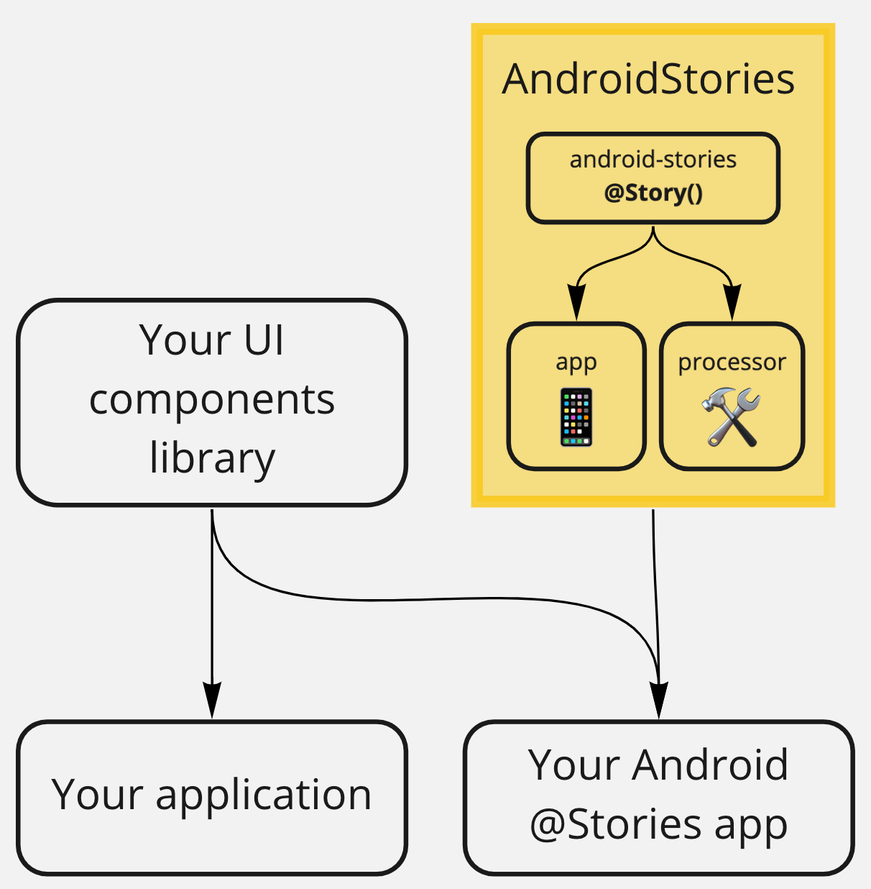

Android Compose Stories
========  

**Compose Stories** is a development environment for UI components on Android.
It allows you to browse a component library, and interactively develop and test components.
The usage of AndroidStories is based on the creation of a dedicated app-module where define stories.

[Here an example app](example-app)
<p align="center">
	
</p>

- [Getting Started](#getting-started)
    - [Gradle configuration](#gradle-configuration)
    - [App class](#app-class)
- [How to use](#how-to-use)

## Getting Started

### Gradle configuration

To start writing stories you need first to add GitHub Packages in your settings.gradle.kts file at
the end of repositories with your GitHub credentials:

```
dependencyResolutionManagement {
    repositoriesMode.set(RepositoriesMode.FAIL_ON_PROJECT_REPOS)
    repositories {
        ...
        maven {
            name = "GitHubPackages"
            url = uri("https://maven.pkg.github.com/igeniusai/compose-stories")
            credentials {
                // Set env variable GPR_USER & GPR_API_KEY if not adding a properties file
                username = githubProperties["gpr.usr"]?.toString() ?: System.getenv("GPR_USER")
                password = githubProperties["gpr.key"]?.toString() ?: System.getenv("GPR_API_KEY")
            }
        }
    }
}
```

add to the example app build.gradle.kts file:

1) kapt plugin to generate the stories provider

```
plugins {
    ...
    id("kotlin-kapt")
}
```

2) Compose Stories dependencies

```
dependencies {
    ...
    implementation("ai.igenius.composestories:core:0.1.4")
    implementation("ai.igenius.composestories:stories-ui:0.1.4")
    kapt("ai.igenius.composestories:processor:0.1.4")
}
```